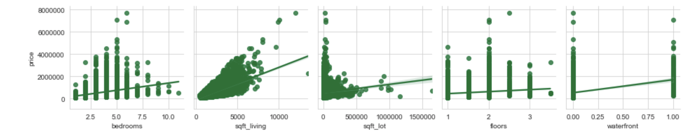
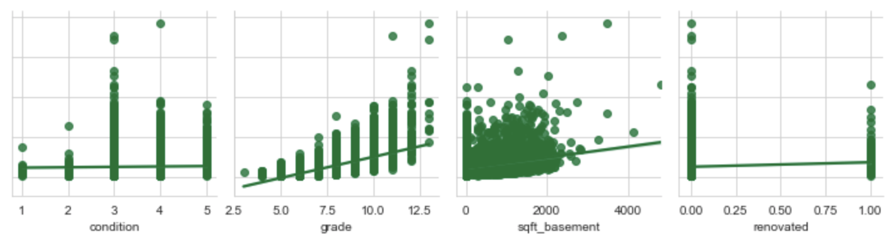
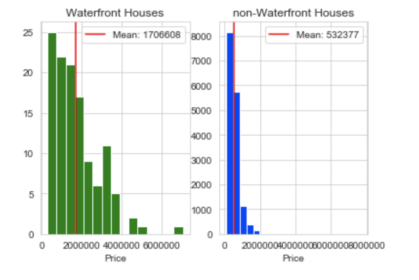
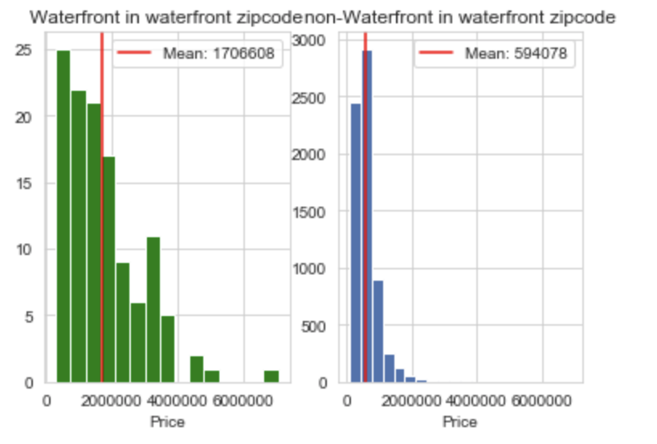
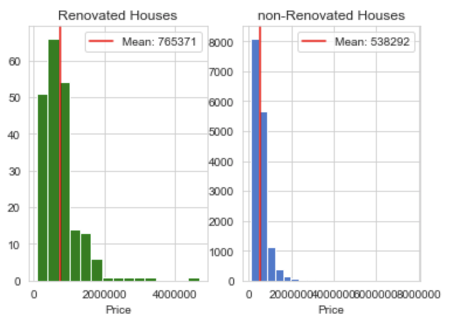

# King County House Data Analysis  
This analysis looks to answer 4 questions:  
1) What variables contribute and how much to the price of the house? (Using a linear regression model)  
2) Are prices between waterfront and non-waterfront houses statistically different?
3) Are the prices between waterfront and non-waterfront houses in waterfront zip codes statistically different?
4) Are the prices between renovated houses in the last 15 years and non-renovated houses statistically different?

## Data Description
The data use for this analysis is from 2015 from King County, Washington. There is data for 21,597 houses which include attributes of the house and location. The dataset can be found in the kc_house_data.csv and a description of the columns in the column_names.md file.

## Data Cleaning
In order to make the data useful, it needed to be modified and cleaned. The following was done to make the data useful for the analysis:  
  
* Rows that were missing year renovated, waterfront and view were removed. They were removed due to not being able to estimate the data points.  
* Placeholders in the sqft_basement column were replaced with the mean of the sqft_basement column.  
* The whole data frame containing data was turn into type float, and all numbers were rounded to 1 decimal place.
* A new column was made called "renovated". This column contains 1 for houses that were renovated within the last 15 years from 2020, and it contains 0 for houses that have never been renovated or were renovated more than 15 years ago from 2020. The yr_renovated column was removed due to redundancy.
*  Column id was removed because it added no value to this analysis. The column view was removed because of no description as to what each value was trying to portray. The columns date, yr_built, and sqft_lot15 were removed after researching the value they could add. The following article was used to reach this conclusion: [Berkshire Hathaway blog on determinants of home appraisals](https://berkshirehathawayhs.tomieraines.com/Blog/ID/272/13-Factors-That-Determine-Your-Home-Appraisal-Value)
*  Columns bathrooms, sqft_above, sqft_living15 were removed due to exceeding the threshold of .75 for correlation with other columns being used for a linear regression analysis.
*  Houses that contain more than 30 bedrooms were removed because they did not fit in the category of residential houses. 

## Analysis
### Regression Analysis  
A baseline linear regression model was created for comparison for later models. The data leftover after cleaning was inputted into a model, and the model scored .664 in the R-squared metric.  
  
On the first iteration, zip code, latitude, and longitude were removed. A log transformation was applied to sqft_lot to meet linearity requirements, and sqft_basement was removed due to not meeting linearity requirements. With these adjustments, the model scored .607 in the R-squared metric.  
  
On the second iteration, zip codes were added back as a categorical variable. The model scored .794 in the R-squared metric.  
  
On the third iteration, bedroom, floors, condition, and grade were transform into categorical variables. the model scored .825 on the R-squared metric.

  
  
**NOTICE:** R-squared can increase due to adding additional variables. Adjusted R-squared is a better measurement because it takes into account the impact of adding additional variables. However, in the previous models both R-squared and adjusted R-squared were equivalent, so R-squared was used.  

## Benchmarking
### Mean Square Error
In order to fully understand how accurate the model is, the square root of mean square error was taken.
Train Error: 153937.83
Test Error: 164352.83
A difference of 10,415. 

### Hypothesis Testing
Three tests were perform with the data to fully understand the impact of renovations and waterfront impact on price. A Welch T-test was performed in order to test the hypothesis associated with each question. 

**Are the prices between waterfronts and non-waterfronts statistically different?**  
Null Hypothesis = mean price for samples is the same.  
alternate = waterfront houses' mean is greater than the mean for non-waterfront houses.  
significance value of 5%  
Results: P-value 5.372067743137726e-24. The test rejects the null hypothesis.

**Are the prices between waterfront and non-waterfront on the same zip codes statistically different?**
Null Hypothesis = mean price for both samples is the same.  
alternate = the sample with a waterfront has a higher mean than the sample in the same zip code without a waterfront.  
significance value of 5%  
Results: P-value 2.974430121330807e-23. The test rejects the null hypothesis.

**Are the the prices between houses renovated in the last 15 years and houses not renovated or houses renovated more than 10 years ago significantly different?**
Null Hypothesis = mean price for both samples is the same.  
alternate = mean price for renovated houses is greater than the mean for non-renovated houses.  
significance value of 5%  
Results: P-value 5.4710997376746386e-08. The test rejects the null hypothesis. 

## Conclusion
The model showed that the following predictors were valuable to the analysis: sqft_living, sqft_lot, waterfront, renovated, zip code, bedrooms, floors, condition, and grade. Most variables add value to the price of a home. As expected, features such as waterfront and higher grades add a premium to the value of a home. Low grades and certain zip codes lower the value of a home. There is a lot of opportunity to further investigate the impact of landmarks and community facilities on the price of homes. The reason to take the investigation this way is because, the model shows that the "bigger is better" conception is not necessarily true. For example, as bedrooms increase the value-added decrease and eventually goes negative. Therefore, investigating the locations can further explain why values of homes in certain zip codes is greater than others.  
  
That is not to say that features of homes are not useful to valuating a home. In one of our tests, it was observed that homes that were renovated tend to be more expensive than homes that have never (or were renovated longer than 15 years from 2020) been renovated. The average price of renovated homes was $765,371 as opposed to a non-renovated home of $538,292. It would be useful to know what it exactly was renovated on the home to further understand why on average the value is higher. However, premium features dramatically increase the value of a home. For example, a waterfront home on average has a price of $1,706,608 compared to a non-waterfront home with an average of $532,377. To further investigate this, the analysis continues to try to isolate the waterfront feature as the only one responsible for the premium price. To do this, homes without waterfront in the zip codes that include homes with waterfront were compared. The test concluded that homes with waterfront were statistically different than homes without waterfront. On average homes without waterfront cost $594,078 and waterfront homes cost $1,706,608. It is safe to say that the waterfront feature is the reason that homes have a premium price. As stated earlier, investigations should follow to understand how location plays a role in the price of a home starting with community facilities and landmarks.